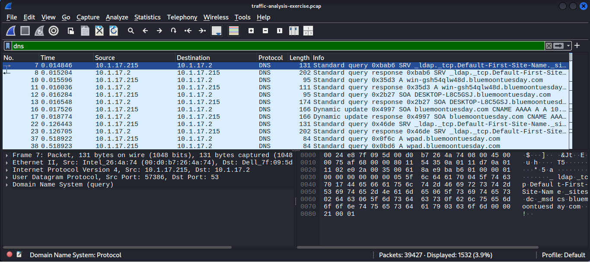
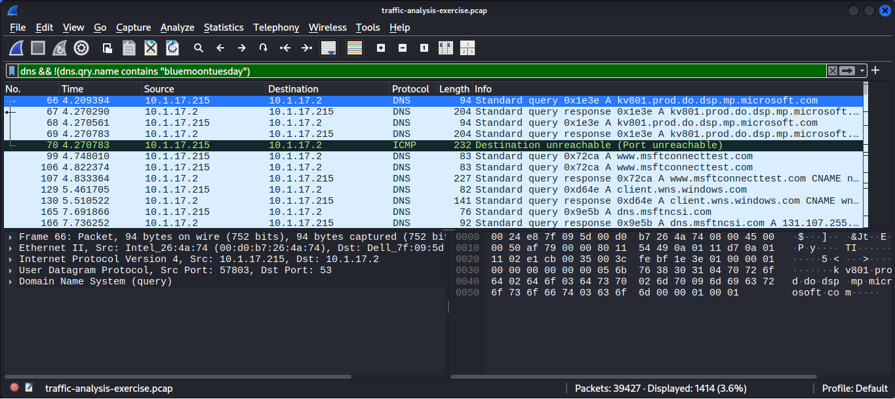
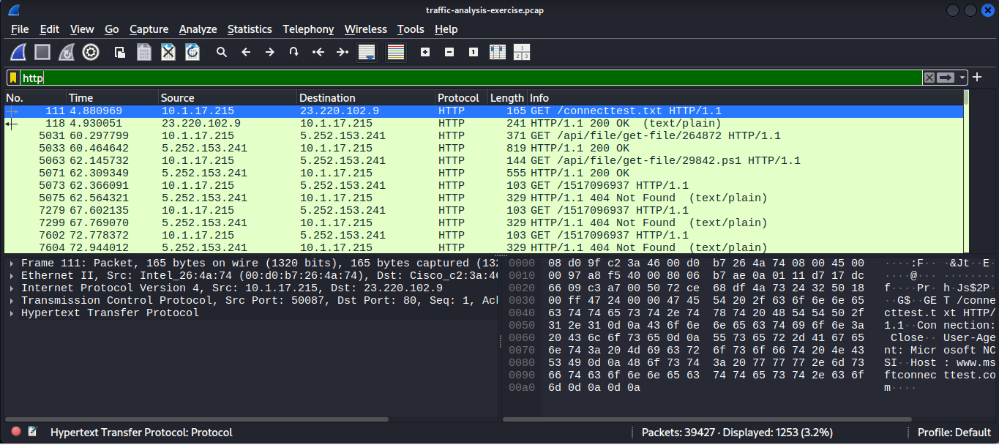
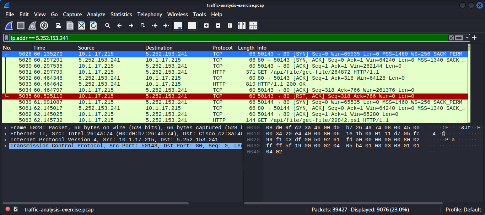

# Threat Hunting Lab – Network Traffic Investigation

## Overview

This project demonstrates a threat hunting investigation using network traffic analysis. The goal of the investigation was to identify suspicious activity within captured network traffic and detect potential malicious behavior.

The analysis was performed using Wireshark to inspect DNS and HTTP traffic and identify indicators of compromise (IOC).

---

## Tools Used

* Wireshark
* PCAP Network Traffic Dataset
* Network Packet Analysis

---

## Investigation Methodology

The investigation followed a structured threat hunting process:

1. Analyzed DNS traffic to identify unusual domain queries
2. Investigated external domain communication
3. Inspected HTTP requests for suspicious file downloads
4. Identified communication with suspicious external IP addresses
5. Detected a PowerShell script download which could indicate malicious activity

---

## Investigation Findings

During the analysis, suspicious HTTP communication was identified between an internal host and an external server.

The internal system downloaded a PowerShell script from an external IP address, which may indicate malicious activity or unauthorized script execution.

---

## Indicators of Compromise (IOC)

**Infected Host**

10.1.17.215

**Suspicious External IP**

5.252.153.241

**Suspicious File Download**

29842.ps1

**Protocol Used**

HTTP

---

## Attack Summary

The internal host **10.1.17.215** initiated communication with the external server **5.252.153.241** over HTTP.

During this communication, a **PowerShell script (29842.ps1)** was downloaded from the external server.

PowerShell scripts are commonly used by attackers to execute malicious commands or download additional malware. This behavior indicates a potential compromise or malicious script execution attempt.

---

## Investigation Screenshots

### DNS Traffic Analysis

### Suspicious Domain Detection

### HTTP Request Analysis

### PowerShell Download Detection

---

## Conclusion

This threat hunting investigation successfully identified suspicious network behavior through packet analysis.

The investigation revealed:

* Suspicious external communication
* PowerShell script download from an external server
* Indicators of compromise related to potential malware activity

Network traffic analysis is a critical skill for Security Operations Center (SOC) analysts to detect threats and investigate security incidents.

---

## Author

Vivek Sharma
Cybersecurity Enthusiast
SOC Analysis | Threat Detection | Network Security

GitHub: https://github.com/vivek-sh45
